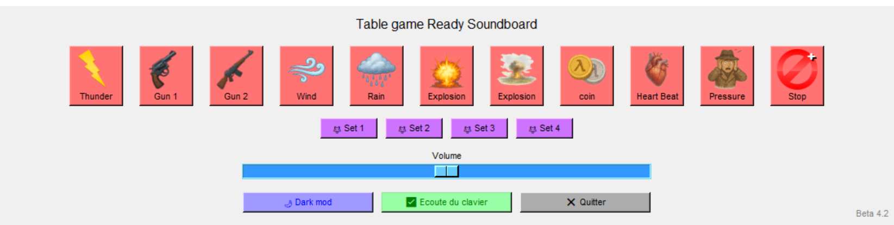

# 🔊 Table Game Ready Soundboard

Une soundboard simple, rapide et prête à l’emploi pour les jeux de rôle ou de plateau.  
🎲 Contrôlable à la souris ou avec le clavier (12 touches supérieures du clavier AZERTY).  
🎛️ Interface graphique via Tkinter, lecture audio avec pygame.

---

## 🖼️ Aperçu visuel



---

## ⌨️ Touches actives (clavier AZERTY)
```
| Touche | Son déclenché |
| Page 1 | :--------- |
| `²`    | Switch page|
| `&`    | Thunder    |
| `é`    | Gun 1      |
| `"`    | Gun 2      |
| `'`    | Wind       |
| `(`    | Rain       |
| `-`    | Explosion  |
| `è`    | Explosion  |
| `_`    | coin       |
| `ç`    | Heart Beat |
| `à`    | Pressure   |
| `=`    | Stop       |

| Touche | Nom du son |
| Page 2 | :--------- |
| `²`    | Switch page|
| `&`    | Fracture   |
| `é`    | Plouf      |
| `"`    | Craft      |
| `'`    | Lock       |
| `(`    | Alien Door |
| `-`    | Vault      |
| `è`    | Old Door   |
| `_`    | Door Slam  |
| `ç`    | Crow       |
| `à`    | KwaKwa     |
| `=`    | Stop       |

| Touche | Nom du son |
| Page 3 | :--------- |
| `²`    | Switch page|
| `&`    | Steve      |
| `é`    | Missing    |
| `"`    | Drop       |
| `'`    | Missing    |
| `(`    | Missing    |
| `-`    | Missing    |
| `è`    | Missing    |
| `_`    | Missing    |
| `ç`    | Missing    |
| `à`    | Missing    |
| `=`    | Stop       |

| Touche | Nom du son |
| Page 4 | :--------- |
| `²`    | Switch page|
| `&`    | cave 1     |
| `é`    | cave 2     |
| `"`    | cave 3     |
| `'`    | Walking    |
| `(`    | Step2      |
| `-`    | Groupe     |
| `è`    | Alarm      |
| `_`    | Alarm Bis  |
| `ç`    | Creak      |
| `à`    | wave       |
| `=`    | Stop       |
```
---

## 🚀 Lancer l’application

1. Installer Python 3.10 ou plus
2. Installer les dépendances :

```
pip install pygame keyboard
```
### Lancer l'application :
```
python app.py
```
🎵 Les sons doivent être placés dans un dossier se/

🖼️ Les images dans un dossier img/

## 🧊 Créer un exécutable Windows (.exe)

1.Installer PyInstaller :
``` 
pip install pyinstaller
``` 
2.Générer l’exécutable (Sous Windows) :
``` 
pyinstaller --noconfirm --onefile --windowed --add-data "img;img" --add-data "se;se" app.py
``` 
📦 Le .exe final sera dans dist/app.exe

💡 Sous Linux/macOS, remplacer ; par : dans les chemins (img:img, se:se)

🔐 nota: les antivirus peuvent percevoir le programme comme menace à la premiere execution, prévoir donc une execution préliminaire avant utilisation.

# 📁 Arborescence recommandée
        soundboard/
        ├── app.py
        ├── img/
        │   ├── thunder.png
        │   └── ...
        ├── se/
        │   ├── thunder.wav
        │   └── ...
        ├── README.md


## ⚙️ Infos techniques

    🖼️ Interface graphique : Tkinter

    🔉 Audio : pygame.mixer.music

    🎧 Un seul son joué à la fois (non superposables)

    🎹 Raccourcis clavier actifs même sans focus (via keyboard)

    ✅ Activation/désactivation de l’écoute clavier via bouton

    🎚️ Curseur de volume intégré

### ☝ Licence

    Projet open-source sous licence MIT. Aucune garantie.

### 👤 Auteur

DBZ-V

